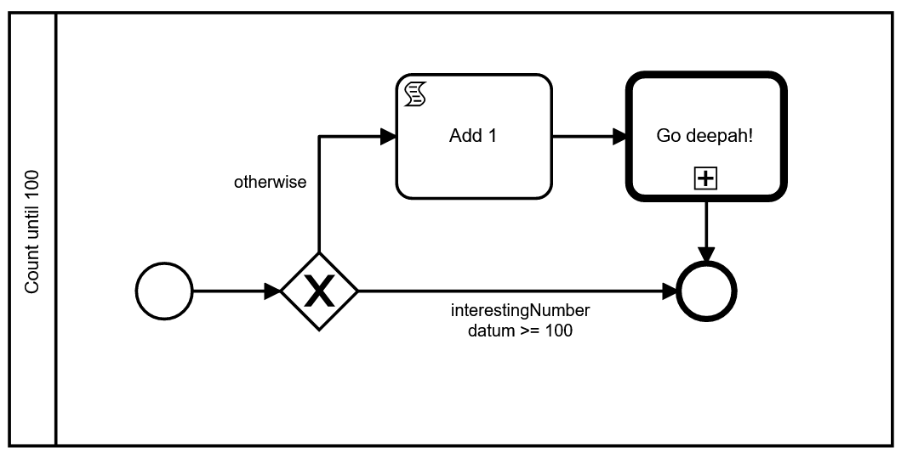

# DasContract Plutus generator

This project can transform [DasContract files](https://github.com/CCMiResearch/DasContract) into Plutus contracts running on the Cardano Blockchain.

DasContract files can be created and edited on the [DasContract editor](https://black-plant-0fbebdc03.azurestaticapps.net/).

**This generator is designed to produce human-readable code.**

## DasContract basics

DasContract is a format for generating blockchain smart contracts using more intuitive tools, such as BPMN language for processes, easily defined data models, and users. 

## How to create a Plutus DasContract

### Data model

Use the data tab to create your data models. Data models are entities and enums that are later translated as records into your Plutus contract.

An entity that is marked as `IsRootEntity="true"` will be the contract datum. Example with many possible situations:

```
  <DataTypes>
    <Entity Id="Root" Name="Datum" IsRootEntity="true">
      <Property Id="interestingNumber"  Name="interestingNumber" IsMandatory="true" PropertyType="Single" DataType="Int" />
      <Property Id="interestingTimeout"  Name="interestingTimeout" IsMandatory="true" PropertyType="Single" DataType="DateTime" />
      <Property Id="interestingMessages"  Name="interestingMessages" IsMandatory="true" PropertyType="Collection" DataType="String" />
      
      <Property Id="prop1"  Name="prop" IsMandatory="true" PropertyType="Single" DataType="Int" />
      <Property Id="prop2"  Name="prop" IsMandatory="true" PropertyType="Single" DataType="Uint" />
      <Property Id="prop3"  Name="prop" IsMandatory="true" PropertyType="Single" DataType="Bool" />
      <Property Id="prop4"  Name="prop" IsMandatory="true" PropertyType="Single" DataType="String" />
      <Property Id="prop5"  Name="prop" IsMandatory="true" PropertyType="Single" DataType="DateTime" />
      <Property Id="prop6"  Name="prop" IsMandatory="true" PropertyType="Single" DataType="AddressPayable" />
      <Property Id="prop7"  Name="prop" IsMandatory="true" PropertyType="Single" DataType="Address" />

      <Property Id="prop8"  Name="prop" IsMandatory="false" PropertyType="Single" DataType="Int" />
      <Property Id="prop9"  Name="prop" IsMandatory="false" PropertyType="Single" DataType="Uint" />
      <Property Id="prop10" Name="prop" IsMandatory="false" PropertyType="Single" DataType="Bool" />
      <Property Id="prop11" Name="prop" IsMandatory="false" PropertyType="Single" DataType="String" />
      <Property Id="prop12" Name="prop" IsMandatory="false" PropertyType="Single" DataType="DateTime" />
      <Property Id="prop13" Name="prop" IsMandatory="false" PropertyType="Single" DataType="AddressPayable" />
      <Property Id="prop14" Name="prop" IsMandatory="false" PropertyType="Single" DataType="Address" />

      <Property Id="prop15" Name="prop" IsMandatory="true" PropertyType="Collection" DataType="Int" />
      <Property Id="prop16" Name="prop" IsMandatory="true" PropertyType="Collection" DataType="Uint" />
      <Property Id="prop17" Name="prop" IsMandatory="true" PropertyType="Collection" DataType="Bool" />
      <Property Id="prop18" Name="prop" IsMandatory="true" PropertyType="Collection" DataType="String" />
      <Property Id="prop19" Name="prop" IsMandatory="true" PropertyType="Collection" DataType="DateTime" />
      <Property Id="prop20" Name="prop" IsMandatory="true" PropertyType="Collection" DataType="AddressPayable" />
      <Property Id="prop21" Name="prop" IsMandatory="true" PropertyType="Collection" DataType="Address" />

      <Property Id="prop22" Name="prop" IsMandatory="false" PropertyType="Collection" DataType="Int" />
      <Property Id="prop23" Name="prop" IsMandatory="false" PropertyType="Collection" DataType="Uint" />
      <Property Id="prop24" Name="prop" IsMandatory="false" PropertyType="Collection" DataType="Bool" />
      <Property Id="prop25" Name="prop" IsMandatory="false" PropertyType="Collection" DataType="String" />
      <Property Id="prop26" Name="prop" IsMandatory="false" PropertyType="Collection" DataType="DateTime" />
      <Property Id="prop27" Name="prop" IsMandatory="false" PropertyType="Collection" DataType="AddressPayable" />
      <Property Id="prop28" Name="prop" IsMandatory="false" PropertyType="Collection" DataType="Address" />

      <Property Id="prop29" Name="prop" IsMandatory="true" PropertyType="Single" DataType="Reference" ReferencedDataType="SecondEntity" />
      <Property Id="prop30" Name="prop" IsMandatory="false" PropertyType="Single" DataType="Reference" ReferencedDataType="SecondEntity" />

      <Property Id="prop31" Name="prop" IsMandatory="true" PropertyType="Collection" DataType="Reference" ReferencedDataType="SecondEntity" />
      <Property Id="prop32" Name="prop" IsMandatory="false" PropertyType="Collection" DataType="Reference" ReferencedDataType="SecondEntity" />

      <Property Id="prop33" Name="prop" IsMandatory="true" PropertyType="Single" DataType="Enum" ReferencedDataType="Enum1" />
      <Property Id="prop34" Name="prop" IsMandatory="false" PropertyType="Single" DataType="Enum" ReferencedDataType="Enum1" />
      <Property Id="prop35" Name="prop" IsMandatory="true" PropertyType="Collection" DataType="Enum" ReferencedDataType="Enum1" />
      <Property Id="prop36" Name="prop" IsMandatory="false" PropertyType="Collection" DataType="Enum" ReferencedDataType="Enum1" />

      <Property Id="prop37" Name="prop" IsMandatory="true" PropertyType="Dictionary" KeyType="Int" DataType="String" />
      <Property Id="prop38" Name="prop" IsMandatory="true" PropertyType="Dictionary" KeyType="Int" DataType="Reference" ReferencedDataType="SecondEntity" />
      <Property Id="prop39" Name="prop" IsMandatory="true" PropertyType="Dictionary" KeyType="Int" DataType="Enum" ReferencedDataType="Enum1" />
      <Property Id="prop40" Name="prop" IsMandatory="false" PropertyType="Dictionary" KeyType="Int" DataType="String" />
      <Property Id="prop41" Name="prop" IsMandatory="false" PropertyType="Dictionary" KeyType="Int" DataType="Reference" ReferencedDataType="SecondEntity" />
      <Property Id="prop42" Name="prop" IsMandatory="false" PropertyType="Dictionary" KeyType="Int" DataType="Enum" ReferencedDataType="Enum1" />

    </Entity>

    <Entity Id="SecondEntity" Name="SecondEntity" IsRootEntity="false">
      <Property Id="propX1"  Name="prop" IsMandatory="true" PropertyType="Single" DataType="Int" />
    </Entity>

    <Enum Id="Enum1" Name="Enum1">
      <Value>Value1</Value>
      <Value>Value2</Value>
      <Value>Value3</Value>
    </Enum>
  </DataTypes>
```

Property `Id` is the name of the property in the Plutus contract. Property `Name` is just a display name. `IsMandatory=true` will make the property a `Maybe` type. Data types are converted by the [conversion table](src/DasContract/DasContract.Blockchain.Plutus.Data/DasContractConversion/DataModels/Properties/Primitive/PrimitivePropertyTypeConvertor.cs). 

### Users

In the editors' tab Users, add appropriate roles and users. These roles and users are later assigned to user tasks (=who should sign the new transaction).

### Process

The contract process is defined using the BPMN language. There are several tools at your disposal:

- Script activities
- Call activities
- User tasks

**Script activities** contain a script that is able to transform a datum into a new datum. The transformation code must be marked with `{-# TRANSITION #-}` pragma. The `datum` keyword is at your disposal. It refers to the root entity. 

Script activities run *automatically* after each transaction is done. They are non-transactional.

```
{-# TRANSITION #-}
datum {
    interestingNumber = interestingNumber datum + 1
}
```

**Call activities** invoke a subprocess. When the subprocess is done, it returns back to the call activity. Subprocesses can contain more call activities. Recursive subprocesses are a possibility. 

Call activities run *automatically* after each transaction is done. They are non-transactional.



**User tasks** are tasks for users to complete. They are basically forms with inputs. You have to select which users are supposed to fill and submit the form (assignee, candidate users, candidate roles). 

The form is defined using an XML. Unfortunately, value binding is currently not supported. See the examples for more specifics.

User tasks are transaction types. They need a new transaction to be submitted.

The behavior is defined using a validation script. Several pragmas are available to define a rich amount of logic. They all should have `datum`, `param` (contracts parameter with users and roles), and `val` (current value of the contract) variables available. 

- `{-# FORM_VALIDATION #-}` - code that validates the form (off-chain and on-chain)
- `{-# EXPECTED_VALUE #-}` - how much Value is expected to be in the contract at this point
- `{-# NEW_VALUE #-}` - how much Value is expected to be in the contract after the transaction is done
- `{-# CONSTRAINS #-}` - additional constraints
- `{-# TRANSITION #-}` - how the datum should be transformed – has an extra `form` variable accessible

All activities can be **sequential multi-instance**, which means they can be executed sequentially more times than once. Unfortunately, loop collection binding is currently not supported. The `dat` keyword is at your disposal (=datum) if you use an expression instead of a number for loop cardinality: `${expression}`.

User tasks can have a **timeout event**, which can timeout at a specified amount of time. The `datum` keyword is at your disposal if you use an expression instead of a POSIXTime for setting the timeout: `${expression}`.

## Examples

[Lock funds for a time contract](src/DasContract/DasContract.Blockchain.Plutus.Console.Tests/Lock funds.dascontract), where you lock funds and unlock them after a time. 

[Playground contract](src/DasContract/DasContract.Blockchain.Plutus.Console.Tests/Playground.dascontract), where many situations and examples are presented in a playground contract. 

## So I have Plutus DasContract; what now?

Stick it in the Plutus convertor and have fun.

This repository provides a .NET CLI project that can do the generation, but the DasContract editor should have built in Plutus conversion soon. 

## Converting using the [DasContract.Blockchain.Plutus nuget](https://www.nuget.org/packages/DasContract.Blockchain.Plutus/)

If you want to convert the contract programmatically, use the [DasContract.Blockchain.Plutus nuget](https://www.nuget.org/packages/DasContract.Blockchain.Plutus/) nuget. The nuget targets `netstandard2.1`, making it very portable. The conversion process has two steps:

```csharp
// 1. Convert DasContract into PlutusContract
var plutusContract = PlutusContractConvertor.Default.Convert(contract);

// 2. Convert PlutusContract into IPlutusCode
var plutusCode = PlutusContractGenerator.Default(plutusContract).Generate();

// 3. Get the Plutus code in string
var plutusCodeString1 = plutusCode.InString();
var plutusCodeString2 = plutusCode.ToString(); //alternative
```

Thanks to the intermediary data model PlutusContract between DasContract and the final code, you can effortlessly model the Plutus contract directly, without the DasContract format. PlutusContract is somewhat similar tho. Examples and tests of directly modelled PlutusContracts are:

1. [DataModel demo](src/DasContract/DasContract.Blockchain.Plutus.Console.Tests/DemoContracts/DataModelDemoContract.cs)
2. [Process demo](src/DasContract/DasContract.Blockchain.Plutus.Console.Tests/DemoContracts/TransitionDemoContract.cs)


